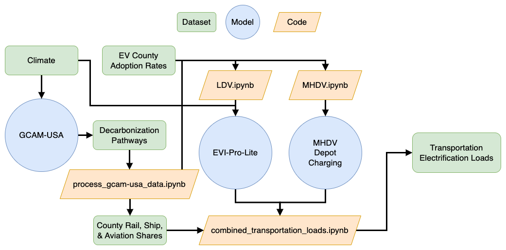

### GODEEEP Transportation Electrification Model
Downscales GCAM transportation electrification loads from annual  state-level loads to hourly balancing authority level loads.

Different approaches are used for each class of vehicles:
* Light Duty Vehicles (LDV): utilizes NREL's [EVI-Pro-Lite API](https://developer.nrel.gov/docs/transportation/evi-pro-lite-v1/) and county meteorology to generate annual hourly load profiles aggregated to balancing authority.
* Medium and Heavy Duty Vehicles (MHDV): utilizes a modified version of NREL's [Heavy-Duty Electric Truck Depot Load](https://github.com/NREL/hdev-depot-charging-2021) model to generate daily hourly load profiles by balancing authority, extended to an annual period.
* Ship, train, and aviation vehicle loads are created by estimating county shares of each mode and population-weighting each county's contribution to balancing authorities. For simplicity, these are considered constant loads throughout the year. These loads are calculated as part of `combined_transportation_load.ipynb`. 

Check out the Jupyter notebooks within the sub-folders for instructions and code for running the LDV and MHDV simulations, then use the notebook `combined_transportation_load.ipynb` to aggregate the results!

#### Workflow Diagram

